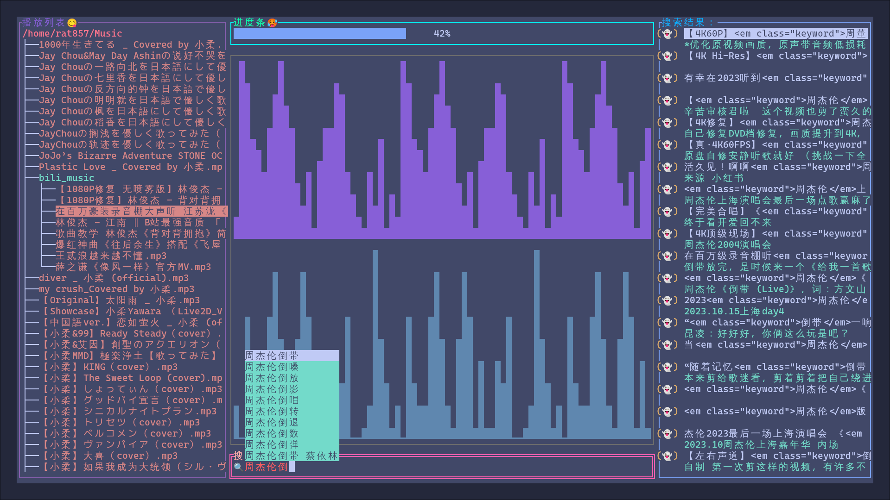

# bilibili_music
bilibili的视频的音频下载及播放，**TUI**🥰

先上效果图：



### 前置提示

目前全功能只支持**Linux**, windows也能运行，不过只能用来播放音乐，且画面有未知bug

- 需要安装ffmpeg，因为下载下来的音乐文件是m4s格式，需要用ffmpeg转为mp3格式，程序会自动调用ffmpeg转换
- 需要有bash (应该所有的linux都自带，，)
- 目前在arch+hyprland上测试无问题

### 写作背景

- 一些bilibili上独有的音乐，其他音乐平台没有版权，而bilibli又不能单纯的下载下mp3格式的文件，比如[小柔翻唱的《最伟大的作品》](https://www.bilibili.com/video/BV1NY4y1J7vt)
- 音乐平台的痛点
  1. 一些在音乐平台需要vip才可以听的歌曲，比如周杰伦的音乐，在bilibili上有人上传视频，可以免费听
  2. 在音乐平台上就算冲vip,你下载下来的音乐也只能在你vip期间享受，不能**所冲即所得**

### 快捷键

| 按键 |  事件  |
| :--: | :----: |
| d,D  | 下一曲 |
| s,S  |  暂停  |

### 特色（不足）

- 因为传输音乐路径用的是管道，所以只能支持下一曲，不能上一曲，如果一定要听上一曲，重启应用就行了🤥
- 为了节省内存，中间的那个流式的东西是假的（只是为了好看）😅，好吧，我不会写🫤

### 食用方法

```shell
git clone https://github.com/rat857/bilibili_music.git
cd bilibili_music
go mod tidy
go build -o bilibili_music
./bilibili_music
```

### 用到的东西

- api方面

  1. 搜索：`https://api.bilibili.com/x/web-interface/search/all/v2?page=1&keyword=最伟大的作品`

  2. 根据搜索得到的avid,获取cid：`https://api.bilibili.com/x/web-interface/view?aid=643175168`

  3. 用aid+cid获取音频信息：`https://api.bilibili.com/x/player/playurl?avid=643175168&cid=765434153&qn=0&fnval=80&fnver=0&fourk=1`

  4. 下载音频

     eg:

     ```shell
     wget 'https://cn-hbwh-cm-01-05.bilivideo.com/upgcxcode/53/41/765434153/765434153_nb3-1-30280.m4s?e=ig8euxZM2rNcNbdlhoNvNC8BqJIzNbfqXBvEqxTEto8BTrNvN0GvT90W5JZMkX_YN0MvXg8gNEV4NC8xNEV4N03eN0B5tZlqNxTEto8BTrNvNeZVuJ10Kj_g2UB02J0mN0B5tZlqNCNEto8BTrNvNC7MTX502C8f2jmMQJ6mqF2fka1mqx6gqj0eN0B599M=&uipk=5&nbs=1&deadline=1695829713&gen=playurlv2&os=bcache&oi=1863457495&trid=00008dae9f08af764440aec8d4b994817cccu&mid=685793285&platform=pc&upsig=28fa4f8f162ef13139372ecdf7f633e4&uparams=e,uipk,nbs,deadline,gen,os,oi,trid,mid,platform&cdnid=10201&bvc=vod&nettype=0&orderid=0,3&buvid=4B224DEB-2415-5ED7-DA61-9B0E0FEB4D4356979infoc&build=0&f=u_0_0&agrr=0&bw=40036&logo=80000000' \
     --referer 'https://www.bilibili.com' \
     -O 'audio.m4s'
     ```

     注意反爬虫，被检测返回403

     

     用到的api教学文档：

     ```url
     https://github.com/SocialSisterYi/bilibili-API-collect/blob/master/docs/video/info.md
     https://github.com/SocialSisterYi/bilibili-API-collect/blob/master/docs/video/videostream_url.md
     ```

  

- 软件方面

  1. m4s文件转mp3:`ffmpeg -i a.m4s bb.mp3`
  2. 播放音乐的go包：[beep](https://github.com/faiface/beep)
  3. 用到的TUI包：[tview](https://github.com/rivo/tview)，[tvxwidgets](https://github.com/navidys/tvxwidgets)
